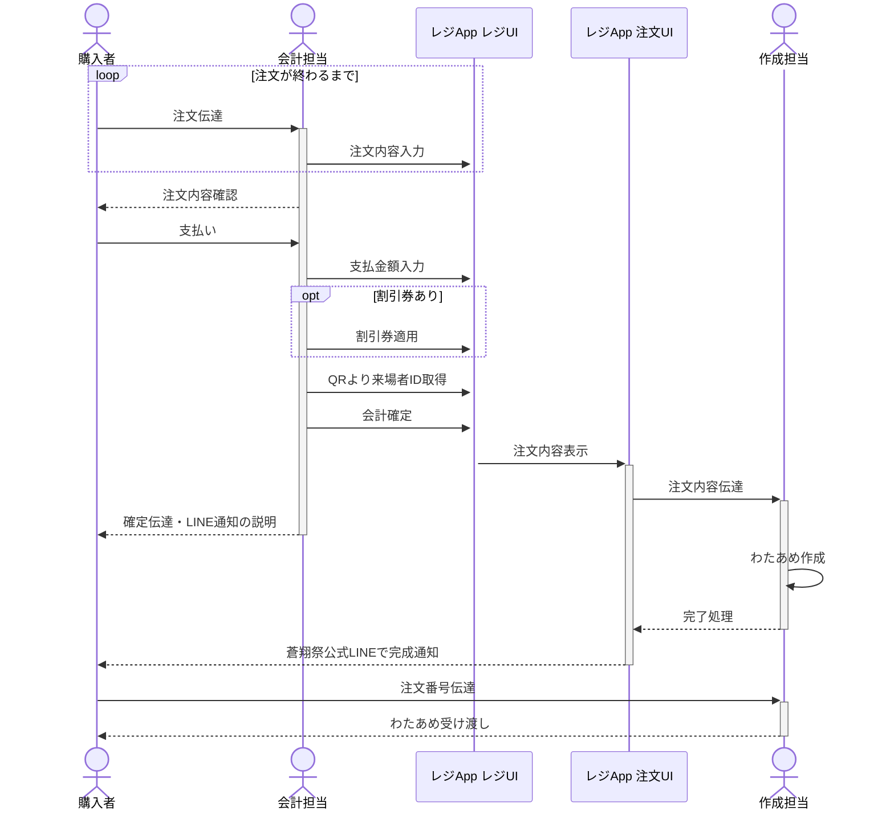

# わたあめ＆ドリンクマニュアル2025 -わたあめ-
---
## 1.企画概要

この企画では、わたあめを作成し来場された方に提供します。わたあめ＆ドリンク企画（わたあめ）では通常、会計とわたあめ作成担当の2名でシフトに入ります。わたあめ作成担当者は原則、わたあめ講習会を受けた人が入ります。わたあめは7色の中から3,2,1色で組み合わせを選び、それに合わせて作成し、提供します。

## 2.全体作業フロー
作業フローを以下に記述しています。参考にしてください。
1. 購入者が注文内容を伝達します。会計担当者は場合に応じてメニュー説明などを行ってください。(購入者・会計担当)
2. 会計担当者は注文内容を専用レジシステムに入力します。(会計担当)
3. すべての注文が終了したら、注文内容を確認し、合計金額を伝達します。(会計担当)
4. 購入者は支払いを行います。その際、割引券があれば提出します。(購入者)
5. 会計担当者は支払金額を入力します。その際、割引券があればそれを適用します。(会計担当)
6. 公式LINE通知用に蒼翔祭来場者アプリから来場者IDを取得します(会計担当)
7. 会計を確定します。また、その旨と注文番号を購入者に伝えます。その際、公式LINEから通知が行くことを伝えてください。(会計担当)
8. 確定後、注文内容がわたあめ作成担当者に伝達されます。(システム)
9. 調理担当者は指示に従い、わたあめを作成します。(作成担当)
10. 完成後、システムで注文状態を完了に変更します。(会計担当)
11. システムはSoshosai System APIを経由して蒼翔祭公式LINEへ完成通知を購入者に対して伝達します(システム)
12. 購入者が受け取りに来たらわたあめを受け渡します。(作成担当)

作業フローシーケンス図

## 3.わたあめの作り方
1. 電源をつけます。左の針を10Aに合わせて暖気運転をします。針が10Aにあっていない場合は、右のダイヤルを回して調整します。
2. 容器から注文ごとにザラメを取り出します。複数色使用する場合は、ザラメさし半分、1色の場合はすりきり1杯を回転釜の穴にゆっくり入れます。複数色使用する場合は、注文画面で書かれた通りの順番でザラメを入れます。
3. ザラメ投入後すぐに綿がでてくるので割り箸に巻き取ります。
4. 割り箸に綿が絡んできたら手元をぐるぐる回します。
5. 巻き取るときに下向きにしたり水平にしたりして形を整えて完成です。
## 4.POSレジシステムfor蒼翔祭
レジシステムの使い方は以下のサイトに記述されています。適宜確認してください。なお、当日わたあめ運用で使用するアカウントは以下のとおりです。

https://pos-system-for-soshosai--pos-system-for-soshosai.asia

| メールアドレス                    | パスワード     |
| -------------------------- | --------- |
| s1320044+wata@u-aizu.ac.jp | sosho2025 |

---
## 緊急時問い合わせ方法
* システムトラブル
	* システムマニュアル参照
* その他ヘルプ
	* Discordで@わたあめ＆ドリンク担当_kikaku1をメンション
	* Discord @haruto.yaにDM
	* トランシーバー等で山﨑へ連絡
