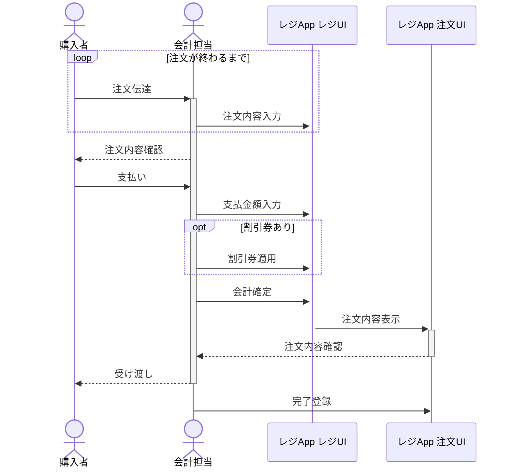

# わたあめ＆ドリンクマニュアル2025 -ドリンク-
---
## 1.企画概要
この企画では、ドリンクを来場した方にしたいして提供します。わたあめ＆ドリンク企画（わたあめ）では通常、会計担当の2名でシフトに入ります。

## 2.全体フロー
1. 購入者は会計担当者に注文内容を伝達します。(購入者)
2. 会計担当者は注文伝達内容をレジAppに入力します。（会計担当者）
3. すべて入力したら注文内容の確認と合計金額の伝達をします。（会計担当者）
4. 支払いをします。（購入者）
5. 支払金額をレジAppに入力します。割引券があれば適用をします。その後、会計を確定します。（会計担当者）
6. レジAppが注文テーブルに注文内容を表示します。（システム）
7. スタッフはそれを確認して水槽から注文された飲み物を取り出します。（会計担当者）
8. 飲み物周辺の水を拭き取り、提供します。（会計担当者）
9. システムに注文完了登録をします。（会計担当者）

作業フローシーケンス図

## 3.POSレジシステムfor蒼翔祭
レジシステムの使い方は以下のサイトに記述されています。適宜確認してください。なお、当日ドリンク運用で使用するアカウントは以下のとおりです。

https://pos-system-for-soshosai--pos-system-for-soshosai.asia-east1.hosted.app/

| メールアドレス                    | パスワード     |
| -------------------------- | --------- |
| s1320044+drin@u-aizu.ac.jp | sosho2025 |

---
## 緊急時問い合わせ方法
* システムトラブル
	* システムマニュアル参照
* その他ヘルプ
	* Discordで@わたあめ＆ドリンク担当_kikaku1をメンション
	* Discord @haruto.yaにDM
	* トランシーバー等で山﨑へ連絡